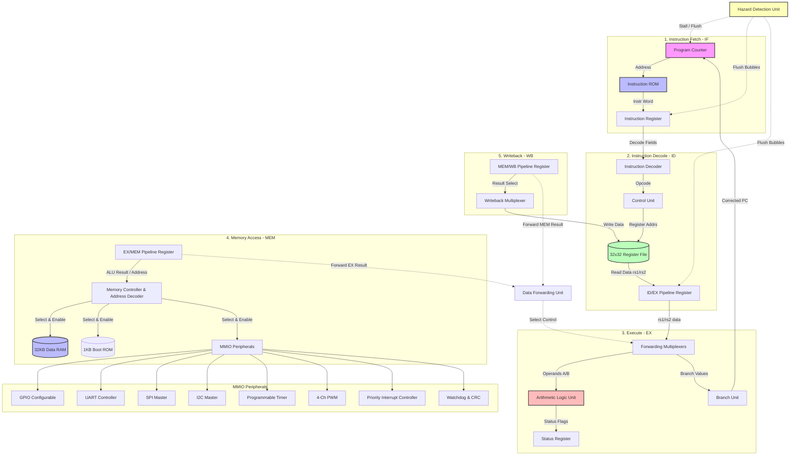

# Custom 32-Bit Pipelined FPGA Microcontroller Architecture Diagram

The microcontroller follows a **Harvard Architecture** with separate instruction and data paths, operating over a **5-stage pipeline**. The system architecture is visualized using the Mermaid diagram below:

